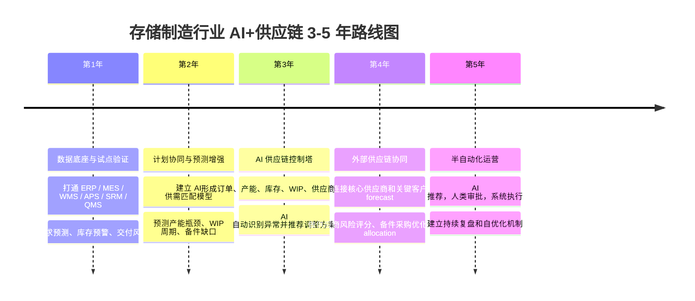
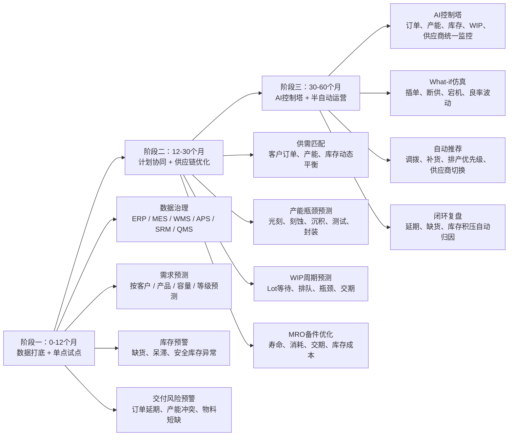
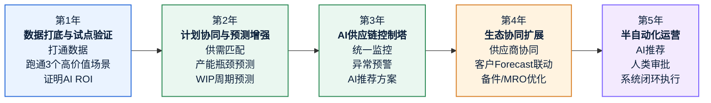
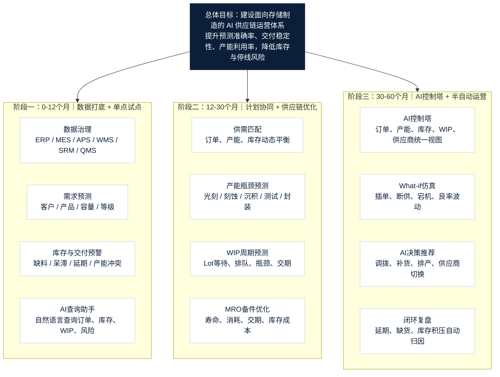
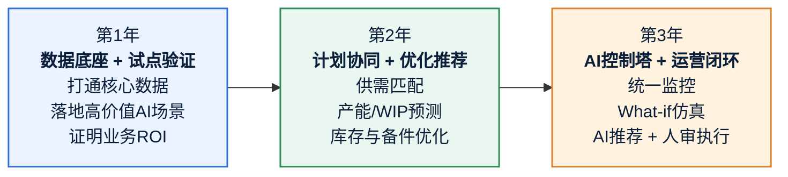
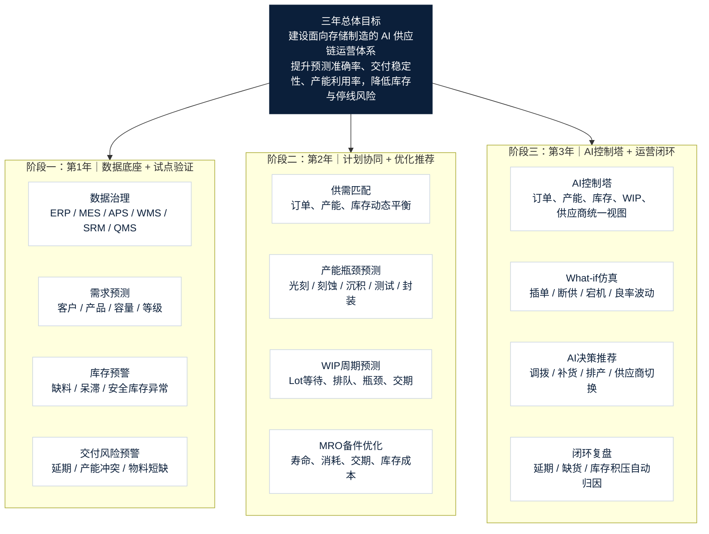

# AI+供应链存储制造行业讨论纪要

## 用户

你能帮我预测中国ai+供应链未来三年的发展吗

## 助手

可以。我的基准判断：**未来三年，中国 AI+供应链会从“单点提效工具”进入“供应链智能操作系统”的早期阶段**。不是一夜之间全自动，而是先在预测、采购、排产、仓配、风控、跨境合规这些环节形成明显增量。

**三年走势**
1. **2026：AI 助手化、控制塔化**
   大模型会大量进入采购、客服、订单跟踪、库存预警、异常解释、报关/单证、供应商问答。企业不一定替换 ERP/WMS/TMS，而是在现有系统上叠一层 AI 决策助手。

2. **2027：从企业内部走向链主协同**
   汽车、新能源、3C、跨境电商、医药冷链、大宗商品会跑得最快。核心变化是链主开始用 AI 连接二三级供应商：预测断供、推荐替代供应商、动态分配产能、自动调整库存策略。

3. **2028-2029：局部半自动供应链**
   部分成熟场景会出现“AI 自动建议，人类审批执行”：比如智能补货、动态排产、仓网调拨、运输路径、供应链金融授信、碳足迹追踪。机器人、无人仓、无人车/无人机配送会在园区、港口、仓储、厂内物流先规模化。

**我最看好的 5 个方向**
- **AI 需求预测 + 库存优化**：尤其适合服装、美妆、食品、生鲜、跨境电商。
- **供应商风险图谱**：把工商、舆情、订单、质量、物流、地缘风险合成一个动态评分。
- **智能排产和数字孪生工厂**：制造业价值最大，但落地慢，需要高质量数据。
- **智能仓储与厂内物流机器人**：中国有很强制造和机器人基础。IFR 数据显示，2024 年中国安装工业机器人 295,045 台，占全球 54%，运行存量超过 200 万台。([ifr.org](https://ifr.org/img/worldrobotics/Executive_Summary_WR_2025_Industrial_Robots.pdf))
- **AI+跨境供应链合规**：关税、原产地、ESG、碳足迹、电池护照、禁限运规则都会变成 AI 自动审查场景。

**主要阻力**
- 数据孤岛：很多企业连 BOM、库存、订单、物流、供应商主数据都没打通。
- 算力和芯片约束：训练大模型受限制，但供应链应用更多是推理和行业小模型，影响可控。
- ROI 压力：2026-2027 会淘汰一批“PPT 式 AI 项目”，真正活下来的会绑定业务指标。
- 责任边界：排产、采购、授信、替代供应商这些决策出错成本高，短期仍会“人审 AI”。

**一句话结论**
未来三年，中国 AI+供应链最大的机会不是做一个通用聊天机器人，而是做“懂行业数据、能接系统、能给决策、能闭环执行”的垂直 AI。它会先改变供应链管理者的工作方式，再逐步改变仓库、工厂、港口和跨境履约本身。供应链重构上，“China+1”不会简单削弱中国，反而会让中国企业更需要 AI 管理东南亚、墨西哥、欧洲等多地供应网络；已有研究也指出，美国进口转向 ASEAN 的同时，ASEAN 供应链仍与中国上游高度绑定。([arxiv.org](https://arxiv.org/abs/2508.06828))

## 用户

请先帮我搜集资料，明确目前ai+供应链有哪些实际成果

## 助手

我先按“已经有落地结果”来整理，尽量只放有场景、数据或部署证据的资料。

**目前可确认的实际成果**

| 场景 | 已有成果 | 代表资料 |
|---|---|---|
| 供应链计划 Agent | 京东已把大模型 Agent 用在供应链计划场景，可生成有依据的计划报告，并改善人工效率、预测准确性、现货率等指标 | [JD 供应链计划 Agent 论文](https://arxiv.org/abs/2509.03811) |
| 商品铺货与库存分配 | 京东用数据驱动的选品与前置仓库存分配，提高本地履约率 0.54%、前置仓需求满足率 1.05%，影响的是百万级订单规模 | [JD 履约优化论文](https://arxiv.org/abs/2509.12183) |
| 外卖/即时配送调度 | 美团路线预测模型已部署到 Turing 平台，路线预测准确率达到 0.819，用于提升骑手路径、派单和履约效率 | [美团路线预测论文](https://arxiv.org/abs/2505.11999) |
| 无人机配送 | 美团在北京八达岭长城开通无人机配送，把原本约 50 分钟步行配送压缩到约 5 分钟，可送食品、饮料和应急物资 | [Business Insider 报道](https://www.businessinsider.com/china-drone-delivery-great-wall-meituan-speed-cost-low-altitude-2024-8) |
| 末端配送数据资产 | 菜鸟开放 LaDe 数据集，覆盖 6 个月、约 1067.7 万包裹、2.1 万名快递员，用于末端配送预测和调度研究 | [菜鸟 LaDe 论文](https://arxiv.org/abs/2306.10675) |
| 仓储机器人 | Geek+ 等中国仓储机器人公司已在 UPS、ASKUL、Dr. Max、Siemens 等仓库落地。其案例披露包括生产率提升 400%、拣选准确率 99.9%、日处理 35 万件等指标 | [Geek+ 案例资料](https://www.geekplus.com/) |
| 制造/仓储自动化底座 | 中国是全球工业机器人最大应用市场。IFR 数据显示，2024 年中国工业机器人安装量 295,045 台，占全球 54%，运行存量超过 200 万台 | [IFR World Robotics 2025](https://ifr.org/img/worldrobotics/Executive_Summary_WR_2025_Industrial_Robots.pdf) |

**归纳一下：现在最实的成果集中在 4 类**

1. **预测与计划**
   需求预测、补货、库存分配、铺货、现货率优化已经不是概念验证，电商和零售企业已经跑出可量化收益。京东的公开论文是目前证据最扎实的一类。

2. **履约网络优化**
   AI 已经在前置仓选品、库存调拨、订单路由、本地履约率提升上发挥作用。这里的收益通常不是“翻倍”，而是 0.x%-几个百分点，但因为订单量巨大，商业价值很高。

3. **配送调度与路径优化**
   美团、菜鸟这类高频履约平台已经把 AI 用在骑手路径预测、派单、时效判断、异常处理上。即时配送是 AI+供应链最成熟的中国场景之一。

4. **仓储自动化和机器人**
   机器人、视觉识别、智能调度系统已经进入大规模商用。它不是单纯“AI 软件”，而是 AI+机器人+WMS/WES/RMS 的组合，成果体现在拣选效率、准确率、仓储密度和用工弹性上。

**我的初步判断**

目前 AI+供应链已经有真实成果，但还没有全面进入“自动驾驶供应链”。最成熟的是：库存、仓储、履约、配送。正在起量的是：供应链计划 Agent、跨境单证、风险预警。还偏早期的是：全链路自动决策、多企业协同自动谈判、复杂供应商替代决策。

## 用户

请再缩小范围，在3d nand存储行业的供应链+ai目前有哪些进展

## 助手

截至 2026 年 6 月，3D NAND 存储行业里的“供应链+AI”已经有几类比较明确的进展：

| 方向 | 目前进展 | 成熟度 |
|---|---|---|
| AI 数据中心拉动 NAND 供应链 | 企业级 SSD、QLC NAND、高密度数据湖存储需求快速上升，厂商开始优先服务 AI/云厂商 | 已商业化 |
| AI 专用 SSD | Micron、Kioxia、SK hynix 都在推面向 AI 训练/推理的数据中心 SSD | 已商业化/样品阶段 |
| GPU 直连存储 | Kioxia/NVIDIA 等在做绕过 CPU、让 GPU 直接访问 SSD 的架构，解决 AI 推理/RAG 的数据瓶颈 | 样品/路线图阶段 |
| NAND 制造智能化 | 缺陷检测、良率预测、工艺控制、设备预测维护已广泛用于半导体制造，但 NAND 厂商公开量化数据较少 | 已落地但不透明 |
| 3D NAND 可靠性 AI/算法 | 利用模型预测/控制 retention、读错误、擦除策略、数据排列，延长寿命、降低延迟 | 研究到工程转化阶段 |
| 中国 YMTC 供应链国产化 | 长江存储在高层数 3D NAND、Xtacking、国产设备线方面推进，但受设备限制影响较大 | 产业化中，受制约 |

**几个具体成果**

1. **Micron：AI 数据湖和高密度企业 SSD 已经落地**
   Micron 6600 ION 使用 G9 QLC NAND，面向 AI、云、企业和超大规模数据中心，容量最高到 245TB，官方称可支持每机架超过 176PB 的存储密度，并强调用于 AI data lake、分析和大数据场景。([Micron](https://www.micron.com/products/storage/ssd/data-center-ssd/6600-ion))

2. **Micron：PCIe Gen6 SSD 服务 AI 服务器**
   Micron 9650 被报道为面向 AI 服务器的 PCIe 6.0 数据中心 SSD，顺序读可到 28GB/s，随机读约 5.5M IOPS，目标是让 GPU 在训练/推理时更少等待数据。([Tom’s Hardware](https://www.tomshardware.com/pc-components/ssds/microns-industry-first-pci-6-0-ssd-promises-sequential-reads-up-to-28-000-mb-s-245-tb-ssd-also-coming-for-those-who-need-capacity-more-than-cutting-edge-speed))

3. **SK hynix：提出 AI NAND 产品路线**
   SK hynix 已公开 AI NAND 战略，方向包括高密度 QLC SSD、超高 IOPS SSD，以及 High Bandwidth Flash。这说明 NAND 厂商正在把产品定义从“通用存储”改成“AI 工作负载分层存储”。([Tom’s Hardware](https://www.tomshardware.com/pc-components/ssds/sk-hynix-unveils-ai-nand-strategy-including-gargantuan-petabyte-class-qlc-ssds-ultra-fast-hbf-and-100m-iops-ssds-also-in-the-pipeline))

4. **Kioxia：与 NVIDIA 推 GPU 可访问 SSD**
   Kioxia 的 CM9/XL-FLASH 类产品目标是 10M IOPS、微秒级读延迟，用于让 NVIDIA GPU 更快访问模型参数、向量库、RAG 数据，减少 CPU/PCIe 路径瓶颈。([Tom’s Hardware](https://www.tomshardware.com/pc-components/ssds/kioxia-announces-new-super-high-iops-ssd-that-helps-accelerate-ai-workloads-on-nvidia-gpus-25-6tb-drive-provides-more-gpu-accessible-memory-for-faster-data-access))

5. **NVIDIA 与存储厂商的协同更深**
   最新报道显示，NVIDIA 与 SK hynix 达成多年存储/内存协同开发协议，范围包括 HBM、LPDDR、3D NAND，并把供应规划、产品路线和 AI 工厂需求更早绑定。([Tom’s Hardware](https://www.tomshardware.com/pc-components/dram/nvidia-and-sk-hynix-ink-multi-year-memory-co-development-and-supply-agreement-seeks-to-address-extended-development-cycles))

6. **AI/算法正在进入 NAND 控制器与可靠性优化**
   例如 2025 年 STAR 研究基于 160 颗真实 3D NAND 芯片，提出状态感知随机化方法，称可把 SSD 寿命提升最高 2.3 倍、平均读延迟降低 50%。这类技术未来可能进入 SSD 控制器固件。([arXiv](https://arxiv.org/abs/2511.06249))

7. **中国 3D NAND 的供应链重点是国产化和设备约束**
   YMTC 在 Xtacking、高层数 NAND 和国产工具试产线上有推进，但美国设备限制仍影响扩产、维护和先进制程迭代。这个领域的 AI 价值更可能先体现在“设备替代过程中的良率提升、工艺窗口优化、供应链风险管理”。([Tom’s Hardware](https://www.tomshardware.com/pc-components/ssds/chinas-ymtc-moves-to-break-free-of-u-s-sanctions-by-building-production-line-with-homegrown-tools-aims-to-capture-15-percent-of-nand-market-by-late-2026))

**一句话判断**

3D NAND 行业的 AI+供应链现在最真实的进展，不是“AI 自动管理整条供应链”，而是三件事：**AI 数据中心重塑 NAND 需求结构，NAND 产品开始为 AI 工作负载定制，AI/机器学习逐步进入制造良率和 SSD 可靠性优化。**  
最成熟的是企业级 SSD 和高密度 QLC；最前沿的是 GPU 直连存储、High Bandwidth Flash 和 3D NAND 近存/存内计算。

## 用户

我现在是一名供应链数字化AI工程师，我想知道的是目前ai已经落地的赋能存储制造行业的供应链的真实案例

## 助手

可以，我按“已经落地、能对应供应链业务流程”的口径整理。结论先说：**存储制造行业公开披露的 AI+供应链案例很少，厂商通常不公开到 Micron/三星 V-NAND/SK hynix 某条产线这种粒度；但三星 SDS、Kioxia、以及半导体智能制造论文里已有可验证落地。**

**真实案例清单**

| 公司/案例 | AI 赋能点 | 对应供应链环节 | 公开证据强度 |
|---|---|---|---|
| Samsung SDS Nexplant 智能制造平台 | AI/IoT 连接设备、MES、排程、物料搬运、设施维护、质量/良率分析 | Fab 内部供应链：WIP 调度、AMHS/搬运、设备稼动、质量追溯 | 高 |
| Samsung SDS 全球 SCM 案例 | AI 销售预测、分销数据分析、全球销售/生产计划协同、防缺货 | S&OP、需求预测、生产计划、库存协同 | 高，但客户匿名 |
| Samsung SDS 智能制造物流 | AI 预测物流设备潜在故障，提高厂内物流设备运转率 | 半导体厂内物料流、搬运设备维护、停线风险控制 | 高 |
| Samsung SDS 设备资产管理案例 | 优化设备和零部件更换生命周期，降低库存和采购成本 | 备品备件供应链、MRO 采购、设备生命周期管理 | 高，但客户匿名 |
| Kioxia 四日市/北上工厂 | 通过 AI/IoT 提升 NAND 制造效率，应对 NAND 供给紧张 | NAND 产能效率、制造瓶颈缓解、供应保障 | 中 |
| 未具名半导体制造公司 SPC AI 案例 | 用时间序列预测提前判断工艺指标风险，减少异常后才响应 | 质量控制、良率稳定、返工/报废减少 | 中 |
| 半导体缺陷检测 AI | 深度学习自动识别 SEM/检测图像缺陷 | Wafer inspection、良率爬坡、质量闭环 | 中，行业通用 |

**最值得你关注的 4 类落地场景**

1. **Fab 内部物流与 WIP 调度**
   Samsung SDS 官方资料提到 Nexplant 覆盖 MES、调度/派工、自动设备数据采集、厂内物流路径、交通控制、搬运路由，并声称对全球 40 个站点、50,000 个物流设施做优化控制。这个非常贴近存储制造里的 wafer lot 搬运、FOUP/stockers/AMHS 调度。  
   资料：[Samsung SDS Factory Solutions](https://www.samsungsds.com/en/manufacturing/manufacturing.html)

2. **需求预测 + 生产销售计划协同**
   Samsung SDS 的全球 SCM 案例写到：为全球电子制造企业建立销售和生产计划系统，用分销数据分析和 AI 销售预测提升预测准确性、防止缺货。这类能力映射到存储行业，就是 DRAM/NAND/SSD 的长期订单、客户 allocation、产能分配和库存策略。  
   资料：[Samsung SDS SCM case](https://www.samsungsds.com/en/manufacturing/manufacturing.html)

3. **设备备件/MRO 库存优化**
   半导体/存储厂的瓶颈不只是晶圆产能，也包括关键设备、腔体、泵、chiller、scrubber、备件和耗材。Samsung SDS 有电子组件制造商案例：通过设备资产管理系统优化设备与零部件更换生命周期，降低库存和采购成本。  
   资料：[Samsung SDS case studies](https://www.samsungsds.com/en/manufacturing/manufacturing.html)

4. **质量/良率 AI**
   Samsung SDS 提到 big-data quality/yield analytics、深度学习视觉检测；论文层面也有半导体制造 SPC 案例，用 AI 预测未来测量值并提前判断 Safe/Warning/Critical，目标是减少异常、停机和材料浪费。  
   资料：[Proactive SPC AI for semiconductor manufacturing](https://arxiv.org/abs/2509.16431)

**Kioxia 这个案例要单独看**

Kioxia 是最贴近 3D NAND 的公开案例。行业媒体报道，Kioxia 在四日市和北上工厂用 AI/IoT 提升制造效率，以缓解 NAND 供不应求；但公开材料没有披露模型、指标和系统架构，所以我会把它归为“真实方向明确，但细节不透明”。  
资料：[Tom’s Hardware on Kioxia NAND supply](https://www.tomshardware.com/pc-components/ssds/kioxia-exec-says-the-ai-boom-means-the-era-of-the-cheap-1tb-ssd-is-over-companys-nand-supply-is-sold-out-for-this-year-and-likely-through-2027)

**对你这个岗位最有价值的判断**

目前存储制造行业里，AI+供应链真正落地最多的不是“端到端自动计划”，而是这些小闭环：

- `需求预测 -> allocation -> 产能/库存策略`
- `MES/WIP 数据 -> lot dispatching -> cycle time 优化`
- `AMHS/搬运设备数据 -> 预测维护 -> 降低停线风险`
- `设备/备件生命周期 -> MRO 库存与采购优化`
- `检测/工艺数据 -> 良率预测 -> 返工和报废控制`
- `全球销售/生产/库存可视化 -> 快速 S&OP 决策`

更直白一点：**现在最真实的机会在“AI 让计划员、制造 IE、设备、质量、采购少靠经验拍脑袋”，而不是 AI 完全接管存储供应链。**

## 用户

请根据以上你搜集并总结的资料，帮我做一个AI+供应链的3-5年可落地规划，大概分为两个板块，第一个板块大概说明每年的一个目标，第二个板块将整体计划拆分为三个阶段，然后每个阶段能够具体做什么，用简单的概括列举出来，你能get我的意思吗，有任何问题，请随时发问

## 助手

能 get。你要的是一个**面向存储制造行业、能落地执行的 AI+供应链路线图**，不是泛泛讲趋势。下面我先按“3D NAND/SSD/存储制造企业”来写，默认覆盖需求预测、产能计划、Fab WIP、设备备件、库存、供应商和交付协同。

**板块一：每年目标**

| 年度 | 核心目标 | 关键词 |
|---|---|---|
| 第 1 年 | 建好数据底座，跑通 2-3 个高价值 AI 试点 | 可视化、预测、预警 |
| 第 2 年 | 从单点 AI 走向供应链计划协同 | 需求预测、产能匹配、库存优化 |
| 第 3 年 | 建立供应链 AI 控制塔，形成跨部门闭环决策 | S&OP、异常响应、仿真决策 |
| 第 4 年 | 延伸到供应商、客户、设备和备件生态 | 外部协同、风险预测、MRO 优化 |
| 第 5 年 | 形成半自动化供应链运营体系 | AI 推荐、人审执行、持续优化 |

如果只做 3 年，可以把第 4-5 年合并成“生态协同与自动化升级”。

**板块二：三阶段落地计划**

**阶段一：数据打底 + 单点试点，0-12 个月**

目标：先证明 AI 能带来业务价值，不急着做“大而全平台”。

可以做：

- 打通核心数据：ERP、MES、WMS、SRM、APS、QMS、设备系统、销售订单、库存、BOM、WIP。
- 建供应链数据看板：订单、库存、WIP、产能、交付、供应商、备件、异常状态。
- 做需求预测模型：按客户、产品、容量、接口、等级预测 NAND/SSD 需求。
- 做库存预警：识别呆滞库存、缺料风险、安全库存异常。
- 做 MRO 备件预测：针对关键设备备件做消耗预测和缺件预警。
- 做交付异常预警：提前发现订单延期、产能冲突、物料短缺。
- 建一个 AI 助手：让计划员能用自然语言查询库存、订单、WIP、交付风险。

建议优先选 3 个试点：

- 需求预测
- 备件/MRO 库存优化
- 订单交付风险预警

阶段成果：

- 预测准确率提升
- 缺料/缺件预警提前
- 计划员查询和分析时间下降
- 库存周转或呆滞库存改善

**阶段二：计划协同 + 供应链优化，12-30 个月**

目标：让 AI 从“看见问题”升级为“给出建议”。

可以做：

- 建 AI 供应链计划引擎：连接需求、产能、库存、WIP、交付。
- 做供需匹配模型：判断哪些客户订单优先满足，哪些产品需要 allocation。
- 做产能瓶颈预测：提前识别 litho、etch、deposition、test、packaging 等环节压力。
- 做 WIP 周期时间预测：预测 lot 在 Fab 内的等待、排队、瓶颈和交期。
- 做动态库存策略：按产品生命周期、客户等级、需求波动自动建议安全库存。
- 做供应商风险评分：结合交付、质量、价格、产能、地缘风险、单一来源依赖。
- 做备件采购优化：结合设备健康度、备件寿命、交期、库存成本生成采购建议。
- 做 AI S&OP 助手：自动生成月度供需缺口、风险、建议方案。

阶段成果：

- 计划周期从“天/周”压缩到“小时级”
- 产能冲突提前暴露
- 关键客户交付稳定性提升
- 备件库存和缺件停机风险同时下降

**阶段三：AI 控制塔 + 半自动运营，30-60 个月**

目标：让 AI 进入供应链运营闭环，做到“监控、预测、推荐、复盘”。

可以做：

- 建供应链 AI 控制塔：统一监控客户需求、产能、WIP、库存、供应商、物流、交付。
- 做 What-if 仿真：模拟大客户插单、设备宕机、供应商断供、需求暴涨、良率波动。
- 做自动化决策推荐：AI 推荐调拨、补货、排产优先级、供应商切换、客户 allocation。
- 做供应商协同平台：让关键供应商共享产能、交期、质量、风险数据。
- 做客户协同预测：与核心云厂商、模组厂、OEM 客户共享 forecast 和库存信号。
- 做质量/良率联动供应链：把良率波动直接映射到可交付量、库存和客户承诺。
- 做知识库和 Agent：把计划规则、异常处理 SOP、客户策略、供应商条款沉淀成 AI Agent。
- 做闭环复盘：每次缺货、延期、库存积压后，AI 自动分析根因和改进建议。

阶段成果：

- 供应链从被动响应变成提前预判
- 重大异常有推荐方案
- 计划、制造、采购、销售、质量之间形成统一语言
- 部分常规决策可由 AI 推荐、人类审批执行

**我建议的主线**

不要一开始就做“端到端 AI 供应链大脑”。更稳的路径是：

第一年做可视化和预测，第二年做计划推荐，第三年做控制塔和仿真，第四到五年再做跨企业协同和半自动决策。

对存储制造来说，最值得先做的不是花哨的生成式 AI，而是这几个硬场景：**需求预测、产能瓶颈预测、WIP 周期时间预测、MRO 备件优化、订单交付风险预警、供应商风险评分。**这些最贴近业务，也最容易算 ROI。

## 用户

你能帮我绘制两个规划图详细论述你刚刚的规划吗，我要向老板汇报

## 助手

能，下面我给你做成**老板汇报版**：两个规划图 + 每张图的论述话术。定位是“存储制造行业 AI+供应链 3-5 年可落地路线”。

**规划图一：年度目标路线图**

**汇报论述**

这张图的核心逻辑是：**先看清，再预测，再推荐，最后半自动执行。**

第 1 年不建议直接做复杂的“AI 供应链大脑”，而是先把数据打通，选几个高价值场景验证收益。存储制造企业的数据通常分散在 ERP、MES、APS、WMS、SRM、QMS 和设备系统里，如果底层数据不统一，AI 很难稳定落地。

第 2 年重点从“可视化”升级到“预测”。对于 3D NAND/SSD 供应链，真正有价值的预测不是单纯销售 forecast，而是需求、产能、WIP、库存、良率、备件和交付的联动预测。

第 3 年建设 AI 供应链控制塔，把订单、产能、库存、WIP、供应商、交付风险放到一个统一决策界面里。目标不是只展示数据，而是让 AI 能告诉计划、制造、采购、销售团队：哪里有风险、为什么有风险、建议怎么处理。

第 4-5 年再向外部协同和半自动运营推进。存储行业受大客户 forecast、晶圆产能、封测产能、关键设备备件、材料供应影响很大，所以后期重点是把 AI 能力扩展到供应商和客户协同中，逐步形成“AI 推荐、人类审批、系统执行”的运营模式。

**规划图二：三阶段落地蓝图**

**汇报论述**

三阶段落地的关键，是把 AI 从“辅助分析工具”逐步变成“供应链运营能力”。

**阶段一：0-12 个月，数据打底 + 单点试点**

这一阶段的目标是快速证明 AI 的业务价值。建议优先选择三个场景：需求预测、库存预警、交付风险预警。

对存储制造企业来说，需求波动大、产品生命周期快、客户 forecast 变化频繁。如果能提前识别某类 NAND、SSD、容量段或客户订单的需求偏差，就能减少缺货和库存积压。同时，交付风险预警可以提前发现产能冲突、物料短缺、WIP 堵点，帮助计划员从被动救火变成提前干预。

**阶段二：12-30 个月，计划协同 + 供应链优化**

这一阶段的目标是让 AI 不只是发现问题，而是给出建议。

重点建设供需匹配、产能瓶颈预测、WIP 周期预测和 MRO 备件优化。存储制造的难点在于前段晶圆制造周期长、工艺复杂、设备瓶颈明显，后段测试封装和客户交付又高度敏感。因此 AI 要能把客户需求、产能、WIP、库存、良率和备件状态放在一起判断。

比如，当 AI 发现某类产品需求上升，但关键工艺段 WIP 堵塞、某设备备件存在缺口时，系统应能提前提示风险，并建议调整排产优先级、备件采购节奏或客户 allocation 策略。

**阶段三：30-60 个月，AI 控制塔 + 半自动运营**

这一阶段的目标是形成真正的 AI 供应链运营闭环。

AI 控制塔不是普通 BI 看板，而是集成监控、预测、仿真、推荐和复盘能力。它可以模拟大客户突然插单、关键供应商断供、设备宕机、良率波动、需求下滑等场景，并给出不同方案对交付、库存、成本和客户优先级的影响。

最终形态是：AI 自动监控风险，自动生成方案，人类审批关键决策，系统执行调整，并在事后自动复盘原因。这样供应链团队就能从“人找数据、人做判断”，升级为“AI 给判断，人做决策”。

**给老板的总结句**

这套规划不是为了做一个概念性的 AI 平台，而是围绕存储制造最核心的经营问题落地：**提高预测准确率、降低库存风险、减少交付延期、提升产能利用率、降低备件缺口和停线风险。**

建议整体推进节奏是：**第一年验证价值，第二年形成协同，第三年建立控制塔，第四到五年走向供应链半自动运营。**

## 用户

你画的图好丑

## 助手

哈哈，收到。刚才那版确实更像“信息草稿”，不太像能直接放进老板汇报里的图。给你换成**更像咨询汇报页的版本**：少一点线条堆叠，多一点战略层级感。

**图一：3-5 年年度路线图**

**老板汇报话术**

这条路线不是一上来做“大而全 AI 平台”，而是按供应链数字化成熟度逐年推进。

第一年先解决数据打通和试点验证，重点证明 AI 能在需求预测、库存预警、交付风险预警上产生业务价值。第二年开始进入计划协同，把需求、产能、WIP、库存和备件联动起来。第三年建设 AI 供应链控制塔，实现统一监控、风险识别和方案推荐。第四年向供应商和客户协同延伸。第五年形成“AI 推荐、人类审批、系统执行”的半自动化供应链运营模式。

**图二：三阶段落地蓝图**

**老板汇报话术**

三阶段的核心逻辑是：从“AI 看见问题”，升级到“AI 给出建议”，最后走向“AI 参与运营闭环”。

第一阶段聚焦数据和试点，先把供应链关键数据连起来，并在需求预测、库存预警、交付风险预警上跑出效果。第二阶段把 AI 嵌入计划流程，重点解决存储制造行业最痛的供需匹配、产能瓶颈、WIP 周期和备件保障问题。第三阶段建设 AI 控制塔，让系统能够模拟异常场景、推荐应对方案，并在事后自动复盘，逐步形成半自动化运营能力。

更适合放 PPT 的标题可以写成：

**“存储制造 AI+供应链三阶段建设路线：从预测预警到智能决策闭环”**

下一步我可以直接帮你把这两张图整理成一页或两页老板汇报版 PPT 文案。

## 用户

如果是三年呢

## 助手

如果压缩成**三年规划**，建议不要简单砍掉第 4-5 年，而是把它们合并进第三年，形成：

**第 1 年：打基础，做试点**  
**第 2 年：做协同，出建议**  
**第 3 年：建控制塔，进闭环**

下面是更适合汇报的三年版。

**图一：三年目标路线图**

**三年目标说明**

| 年度 | 建设主题 | 核心目标 | 代表场景 |
|---|---|---|---|
| 第 1 年 | 数据底座 + 试点验证 | 建立数据基础，跑通 2-3 个 AI 场景 | 需求预测、库存预警、交付风险预警 |
| 第 2 年 | 计划协同 + 优化推荐 | 从“发现问题”升级到“推荐方案” | 供需匹配、WIP 周期预测、产能瓶颈预测、MRO 备件优化 |
| 第 3 年 | AI 控制塔 + 运营闭环 | 形成统一监控、仿真决策和闭环复盘 | AI 控制塔、What-if 仿真、AI 推荐、人审执行 |

**图二：三阶段落地蓝图**

**老板汇报话术**

三年规划的核心节奏是：**第一年把数据和试点做扎实，第二年把 AI 嵌入计划流程，第三年形成供应链控制塔和运营闭环。**

第一年主要解决“数据能不能用、AI 能不能产生价值”的问题。重点打通 ERP、MES、APS、WMS、SRM、QMS 等系统数据，并优先选择需求预测、库存预警、交付风险预警三个高价值场景，尽快形成可量化收益。

第二年重点从“预警”走向“推荐”。AI 不只是告诉我们哪里有风险，还要能结合订单、产能、WIP、库存、备件和供应商情况，给出供需匹配、产能瓶颈、WIP 周期和备件采购建议。

第三年建设 AI 供应链控制塔，把监控、预测、仿真、推荐和复盘整合起来。当出现大客户插单、设备宕机、供应商断供、良率波动等场景时，系统能够模拟不同方案的影响，并推荐最优处理路径，最终形成“AI 推荐、人类审批、系统执行”的运营模式。
